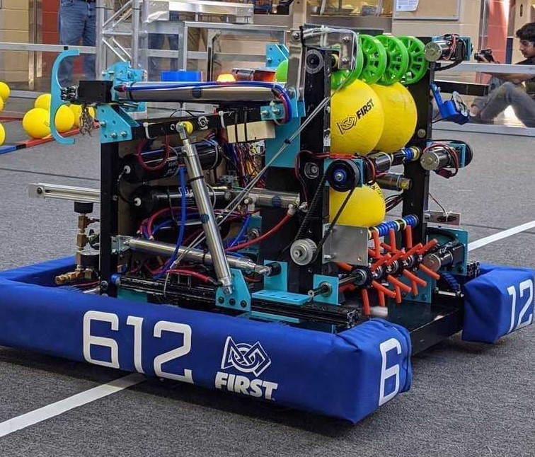

# 612 Robot 2020
Chantilly Robotics Team 612 Repository for 2020 Infinite Recharge

## Robot Description


* __Deposit:__ lower port, 4-5 balls per cycle
* __Climb:__ consistent pneumatic climb during endgame
* __Drive:__ West coast drive, able to drive through trench
* __Color Wheel:__ consistent stage one and two color wheel

## File Structure
```$xslt
team612.java.frc.robot - Parent package for all robot code
    /commands - Contains subfolders for robot functionality
    /controls - Contains ControlMap.java which stores all button configurations
    /subsystems - Contains classes for sensor/motor initialization, and robot functionality
    Constants.java - Contains port configuration for all sensors/motors
    Main.java - Contains gradle initialization for robot deploying
    Robot.java - Contains main loop for robot code and scheduler
    RobotContainer.java - Contains button bindings, subsystem objects, and default commands
```

## Software Dependencies
* [CTRE Phoenix](http://devsite.ctr-electronics.com/maven/release/com/ctre/phoenix/Phoenix-latest.json)
* [ADIS16448 IMU](http://maven.highcurrent.io/vendordeps/ADIS16448.json)
* [NavX](https://www.kauailabs.com/dist/frc/2020/navx_frc.json)
* [REV Color Sensor](http://revrobotics.com/content/sw/color-sensor-v3/sdk/REVColorSensorV3.json)
* [REV Robotics](http://www.revrobotics.com/content/sw/max/sdk/REVRobotics.json)
* JSON Simple: `compile 'com.googlecode.json-simple:json-simple:1.1.1'` to `dependencies {}` in `build.gradle`
